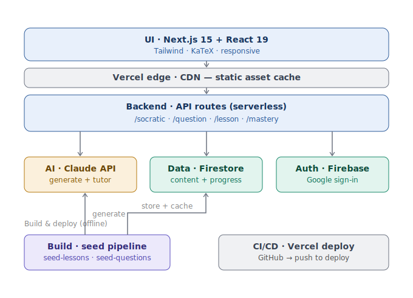
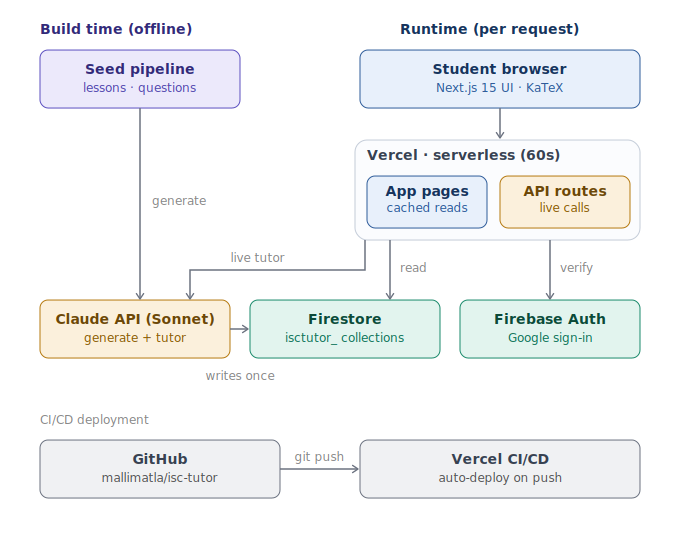

# ISC Tutor — Low-Level Design

**A Socratic AI tutor for ISC Class 11 & 12 Mathematics**

| | |
|---|---|
| **Author** | Nagamallaiah Matla |
| **Version** | 1.0 |
| **Status** | Working build |
| **Live** | https://isc-tutor.vercel.app |
| **Source** | https://github.com/mallimatla/isc-tutor |

---

## Contents

1. [Purpose & scope](#1-purpose--scope)
2. [System overview](#2-system-overview)
3. [The core design decision](#3-the-core-design-decision)
4. [Component design](#4-component-design)
5. [Data model — Firestore schema](#5-data-model--firestore-schema)
6. [Key data flows](#6-key-data-flows)
7. [Adaptive difficulty & mastery](#7-adaptive-difficulty--mastery)
8. [Caching strategy](#8-caching-strategy)
9. [Tradeoffs & alternatives considered](#9-tradeoffs--alternatives-considered)
10. [Scale considerations](#10-scale-considerations)
11. [Security & privacy](#11-security--privacy)
12. [Known limitations & future work](#12-known-limitations--future-work)

---

## 1. Purpose & scope

ISC Tutor teaches ISC Class 11 and 12 mathematics the way a good human tutor does — through Socratic dialogue that never hands over the answer, only the next question, until the student reasons to the solution themselves.

Most learning apps optimise for *answers*. A student stuck at 10pm gets the solution, copies it, and learns nothing. A skilled tutor instead asks a guiding question, then another, adapting to where the student is actually stuck. That behaviour is expensive, doesn't scale, and is unavailable the moment the tutor leaves. ISC Tutor reproduces it as software.

**Goals**

- A patient, always-available tutor that withholds the answer and guides via questions.
- Illustrated, syllabus-accurate lessons per chapter, with mathematically correct diagrams.
- Adaptive practice that scales difficulty to the student and tracks mastery at a fine-grained sub-skill level.
- Run effectively free on a hobby-tier deployment.

**Non-goals (deliberate scope cuts)**

- Not all subjects, not all boards — ISC mathematics, Classes 11 and 12 only.
- Not a question repository or video platform — one capability (Socratic tutoring) done well.
- Not a replacement for full JEE preparation — a daily concept-and-practice layer that complements real previous-year papers.

---

## 2. System overview

A student request flows top-down: the UI is served through Vercel's edge CDN, hits serverless API routes, which call three platform services — Claude for AI, Firestore for data, and Firebase Auth for identity. An offline build pipeline sits beneath the request path: it generates content with Claude and writes it into Firestore once, and CI/CD ships the application from GitHub to Vercel.



> **Figure 1.** Layered architecture. Runtime request flows top-down; the offline build pipeline populates the data tier.

| Layer | Technology | Responsibility |
|---|---|---|
| UI | Next.js 15, React 19, TailwindCSS, KaTeX | Rendering, math typesetting, client state, navigation. |
| Edge / cache | Vercel CDN | Serves and caches static assets close to the user. |
| Backend | Next.js API routes (serverless) | Request handling, orchestration of AI + data + auth. |
| AI | Anthropic Claude (Sonnet) | Content generation (build time) and live Socratic dialogue (runtime). |
| Data | Cloud Firestore | Pre-computed content, dialogue logs, user progress. |
| Identity | Firebase Auth | Google sign-in, session identity. |
| Build | Node ESM seed scripts | One-time content generation and seeding. |
| CI/CD | GitHub → Vercel | Push-to-deploy. |

---

## 3. The core design decision

The single most consequential decision is **where content generation runs**. The deployment target is Vercel's hobby tier, where a serverless function is terminated at **60 seconds**. A rich illustrated lesson — narrative plus several mathematically-accurate diagrams — takes **65–75 seconds** to generate. Generating on the request path therefore failed every time: the function timed out, the write never completed, and the chapter rendered an empty fallback.

Rather than pay to lift the limit, generation was moved **off the request path entirely**. Static content is generated **once, locally**, where no timeout applies, and persisted to Firestore. At runtime the application only **reads** that content, which is effectively instant. The one thing that must remain live — the Socratic dialogue — stays at request time, because it is a genuine conversation that cannot be pre-computed.



> **Figure 2.** Build-time vs runtime. Claude and Firestore are shared by both, but used at opposite times — generate-and-store at build, read-and-chat at runtime.

> **Why this matters.** Moving generation off the hot path eliminated an entire class of timeout failures, kept the deployment on the free tier, and made the read path contain no AI call at all. Firestore became the seam between "expensive and occasional" and "cheap and constant".

---

## 4. Component design

### 4.1 UI layer

A Next.js 15 (App Router) application. Primary screens: a personalised **dashboard** with a colour-coded chapter/mastery grid; a per-chapter **Learn** view (illustrated lesson with interspersed SVG diagrams and, for selected chapters, hand-built interactive React visualisations); and a **Practice** view that hosts the Socratic chat. Math is typeset with KaTeX. The Learn/Practice toggle keeps Practice always reachable, and the header logo is a persistent home link.

### 4.2 Backend — API routes

Serverless route handlers orchestrate the services. All Firestore access goes through a single Admin SDK module; all collection references go through a `col()` helper that applies the `isctutor_` prefix.

| Route | Method | Purpose | Touches |
|---|---|---|---|
| `/api/chapter-lesson` | GET | Fetch a seeded lesson. Read-only — returns `not_generated` if absent, never generates. | Firestore (read) |
| `/api/question` | GET | Serve a practice question: bank-first selection at the target difficulty, runtime generation as fallback. | Firestore, Claude (fallback) |
| `/api/socratic` | POST | Advance one Socratic dialogue turn; streams the tutor's guiding response. Max 5 turns; tags sub-skills. | Claude (live), Firestore |
| `/api/mastery` | GET / POST | Read mastery state; record practice outcomes and the lesson-opened signal. | Firestore |
| `/api/greeting` | GET | Generate a short personalised greeting from prior activity. | Claude, Firestore |
| `/api/debug-firebase` | GET | Diagnostics. Guarded behind `DEBUG_ENDPOINT_KEY`. | Firestore |

### 4.3 AI integration

A single Anthropic client wraps all Claude calls. Prompts are version-controlled in `lib/prompts/` (`lesson-v3.0`, `socratic-v1.0`, the question-generation prompt, and the greeting prompt) so behaviour is reproducible and auditable. A `safeParseClaudeJson()` helper strips Markdown code fences before JSON parsing to harden against malformed model output. Diagrams are generated as **pure SVG** (sanitised to strip scripts and event handlers) rather than sandboxed HTML, which guarantees accurate, directly-renderable math figures.

### 4.4 Build pipeline

Two resumable Node ESM scripts run locally with no time limit:

- `seed-lessons.mjs` — for each chapter, generates the narrative and pure-SVG diagrams via Claude and writes a `lesson-v3.0` document. Flags: `--only`, `--force`, `--list`. Skips chapters already at the current version.
- `seed-questions.mjs` — generates a pool of questions per chapter across difficulty tiers, then **independently re-solves** each to verify the answer key, writing only verified items.

Both load `.env.local` via dotenv and use the Firebase Admin SDK. The syllabus is extracted to JSON (`lib/isc-syllabus`) so the scripts can read it without a TypeScript loader.

---

## 5. Data model — Firestore schema

All collections share the `isctutor_` prefix (the Firestore project is shared with other apps; the prefix namespaces this one). Documents are JSON; there are no joins — read patterns are satisfied by document shape. *Field names below reflect the design; reconcile against the live code where exact casing differs.*

### 5.1 Chapter lessons — `isctutor_chapter_lessons`

One document per chapter, keyed by `lessonId` = `{classLevel}-{chapterId}` (e.g. `11-trigonometric-functions`). Pre-generated; read-only at runtime.

| Field | Type | Description |
|---|---|---|
| `chapterId` | string | Chapter slug, e.g. `sets`. |
| `classLevel` | number | 11 or 12. |
| `lessonId` | string | Composite key `{classLevel}-{chapterId}`. |
| `promptVersion` | string | Generator version, e.g. `lesson-v3.0` (cache-invalidation signal). |
| `generatedAt` | timestamp | When the document was seeded. |
| `syllabusCoverage` | string[] | Sub-skills covered (shared taxonomy). |
| `hook` | string | Opening real-world hook for engagement. |
| `heroImageBase64` | string \| null | Optional decorative hero image (null → CSS gradient banner). |
| `diagrams` | object[] | Each: `{ id, title, svg, caption, afterBeat }` — sanitised SVG figure placed after a given narrative beat. |
| `narrative` | object | See shape below. |

```jsonc
// narrative shape
{
  "beats": [{ "title": "string", "content": "string" }],   // 9–11 teaching beats
  "commonMistakes": [{ "mistake": "...", "why": "...", "fix": "..." }], // 4–5 items
  "quickReferenceCard": ["string"],                         // 4–6 formulae / facts
  "keyTakeaway": "string"
}
```

### 5.2 Question bank — `isctutor_question_bank`

Pre-seeded, answer-verified practice questions. Selected at runtime by chapter and target difficulty for instant load.

| Field | Type | Description |
|---|---|---|
| `id` | string | Document id. |
| `chapterId` / `classLevel` | string / number | Owning chapter. |
| `difficulty` | number (1–5) | Board → JEE Main → JEE Advanced ladder. |
| `type` | enum | `single-correct`, `numerical`, `multiple-correct`, `assertion-reason`. |
| `subSkills` | string[] | Tags from the shared sub-skill taxonomy. |
| `questionText` | string | Prompt, LaTeX inline. |
| `options` | string[] \| null | For choice types. |
| `correctAnswer` | string | Verified answer key. |
| `conciseSolution` | string | Stored for verification + fallback; not shown in normal flow. |
| `verified` | boolean | True only when generation and an independent re-solve agreed. |
| `source` | string | Provenance, e.g. `seed-claude`. |

### 5.3 Socratic dialogues — `isctutor_dialogues`

One document per practice attempt's dialogue. Captures the multi-turn exchange and the sub-skill diagnosis. Bounded to a maximum of five turns.

| Field | Type | Description |
|---|---|---|
| `userId` | string | Owning student. |
| `chapterId` | string | Context chapter. |
| `questionRef` | string | Question being worked. |
| `promptVersion` | string | e.g. `socratic-v1.0`. |
| `turns` | object[] | Each: `{ role, content, timestamp }`. |
| `subSkillTags` | string[] | Sub-skills where the student struggled — feeds mastery. |
| `resolved` | boolean | Whether the student reached the answer. |

### 5.4 User progress — `isctutor_user_progress`

One document per user. Holds mastery scores, the lesson-opened signal, and per-user served-question tracking so practice does not repeat.

| Field | Type | Description |
|---|---|---|
| `userId` | string | Firebase Auth UID. |
| `mastery` | map | `{ [subSkill]: score 0–1 }` — practice-derived mastery. |
| `learningOpened` | map | `{ [chapterId]: timestamp }` — set once when a lesson is opened (the "Learning" state). |
| `recentOutcomes` | map | Rolling window of recent results per chapter, driving adaptive difficulty. |
| `servedQuestions` | map | `{ [chapterId]: id[] }` — bank items already shown, to avoid repeats. |

---

## 6. Key data flows

**Learn flow**

1. Student opens a chapter's Learn view.
2. UI calls `/api/chapter-lesson`; the route reads the `lesson-v3.0` document from Firestore and returns it (no AI call).
3. UI renders hook, beats with interspersed SVG diagrams, common mistakes, quick-reference card; an interactive widget renders above for supported chapters.
4. A one-time `learningOpened` signal is recorded, flipping the chapter to the "Learning" state on the mastery grid.

**Practice + Socratic flow**

1. Student opens Practice; `/api/question` selects a verified, unseen question from the bank at the adaptive target difficulty (instant). If the pool is exhausted, it falls back to runtime generation.
2. Student submits an answer.
3. `/api/socratic` evaluates and, instead of revealing the answer, streams the next guiding question; the exchange is appended to `isctutor_dialogues` with sub-skill tags. Bounded to five turns.
4. On resolution, the outcome updates `recentOutcomes` and `mastery`.

**Seed flow (build time)**

1. Operator runs `npm run seed:lessons` / `seed:questions` locally.
2. For each chapter, the script calls Claude to generate content; questions are independently re-solved to verify keys.
3. Verified output is written to Firestore. Already-current chapters are skipped (resumable).

---

## 7. Adaptive difficulty & mastery

A single **sub-skill taxonomy** is shared across lessons (`syllabusCoverage`), questions (`subSkills`), dialogues (`subSkillTags`), and mastery scores. This shared vocabulary is what makes the mastery map meaningful rather than decorative — a struggle diagnosed in dialogue maps to the same sub-skill the lesson taught and the map displays.

**Adaptive difficulty** uses a rolling weighted window of the last five outcomes per chapter: difficulty bumps up when the recent score is ≥ 0.8 and down when ≤ 0.4, otherwise holds.

**Progress states** layer cleanly: *not started* → *learning* (lesson opened; a small fixed progress and accent) → *practicing* (real practice-derived mastery %) → *mastered* (threshold met). The lesson-opened signal only ever *adds* an earlier state; it never overwrites a real practice score.

---

## 8. Caching strategy

There are two real caches, and deliberately no third:

- **Edge / CDN cache** — Vercel caches static assets at the edge automatically.
- **Pre-computation as caching** — the expensive AI output (lessons, verified questions) is computed once at build time and persisted in Firestore. The runtime never pays the generation cost; it reads a warm result. This trades content freshness for speed and cost, which is the correct trade for static curriculum material.

> **Honest limitation.** There is **no in-memory / Redis cache** for live results. The live Socratic turns and the runtime question fallback call Claude directly. A short-TTL cache for repeated runtime questions is identified future work, not a current component.

---

## 9. Tradeoffs & alternatives considered

| Decision | Chosen | Rejected alternative | Rationale |
|---|---|---|---|
| Content generation | Pre-compute locally, store in Firestore | Generate on the request path | 60s serverless limit vs 65–75s generation time; precompute removes timeouts and stays free. |
| Diagram format | Sanitised pure SVG | Sandboxed interactive HTML | SVG renders directly and is mathematically accurate; HTML hit sandbox rejection and rendering errors. |
| Interactivity | Hand-built React widgets for high-value chapters | Interactive widgets for all 29 | Deliberate prioritisation of pedagogical value over uniform coverage. |
| Generation model | Anthropic Claude | OpenAI image/text models | Reliable access and strong math; OpenAI project-key hit billing/quota limits. |
| Question delivery | Seeded bank + runtime fallback | Pure runtime generation | Instant common-case load while keeping practice effectively infinite. |
| Answer correctness | Independent second-solve verification | Trust first generation | Hard-math answer keys are error-prone; verification gates writes. |

---

## 10. Scale considerations

The system currently targets a small cohort (a household, extensible to a class). The architecture scales asymmetrically:

- **Reads scale cheaply.** The read path is pure Firestore document reads with no AI call; Firestore and the CDN absorb growth well.
- **The cost driver is live Socratic dialogue.** Each turn is an LLM call. At scale this is the dominant spend and latency source — mitigations: a short-TTL cache for repeated runtime questions, response streaming (already in place), turn bounding (already in place, max 5), and per-user rate limiting.
- **Seeding is offline and batched**, so adding chapters or subjects is an operator task, not a runtime concern.
- **Deployment headroom.** Moving off the hobby tier removes the 60s constraint and would permit selective runtime generation if ever desired.

---

## 11. Security & privacy

- **Authentication** via Firebase Auth (Google sign-in); the UID is the partition key for all user data.
- **Firestore rules** scope user-progress and dialogue documents to their owner; seeded content is read-only to clients.
- **Minor-user privacy.** The primary user is a school student; the system stores no PII beyond the account identity and keeps content age-appropriate.
- **Diagnostics** (`/api/debug-firebase`) are gated behind `DEBUG_ENDPOINT_KEY`.
- **Secrets** (Claude key, Firebase Admin credentials) live in environment variables and must never be committed; rotate on any suspected exposure.

---

## 12. Known limitations & future work

- Runtime question generation (the fallback path) has cold-start latency; the fix — a fully-seeded verified bank — is in progress.
- Decorative hero images are disabled pending an image-generation billing/key fix; CSS gradient banners stand in.
- Interactive widgets cover the highest-value chapters, not all 29 (deliberate scope).
- The model string in use is on a deprecation path and must be updated.
- LaTeX rendering in the "common mistakes" fix lines needs a front-end fix (no re-seed required).
- No automated test suite yet — the first investment given more time.
- AI-generated questions are answer-verified by re-solve but should be human-spot-checked and treated as a supplement to real previous-year papers for serious exam preparation.
- No live-result cache (see §8); a short-TTL layer is the next infrastructure addition.

---

*ISC Tutor — Low-Level Design · v1.0 · Nagamallaiah Matla. Built solo with Claude Code as engineering partner.*
